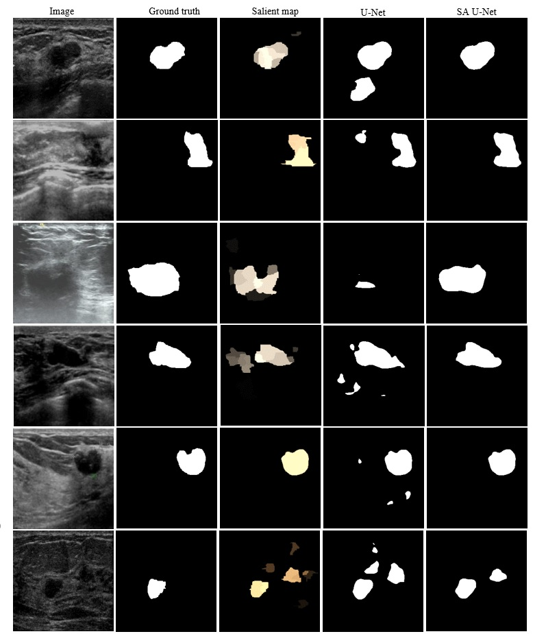
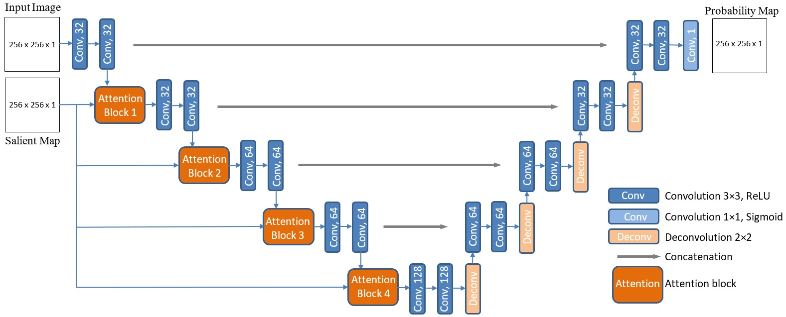
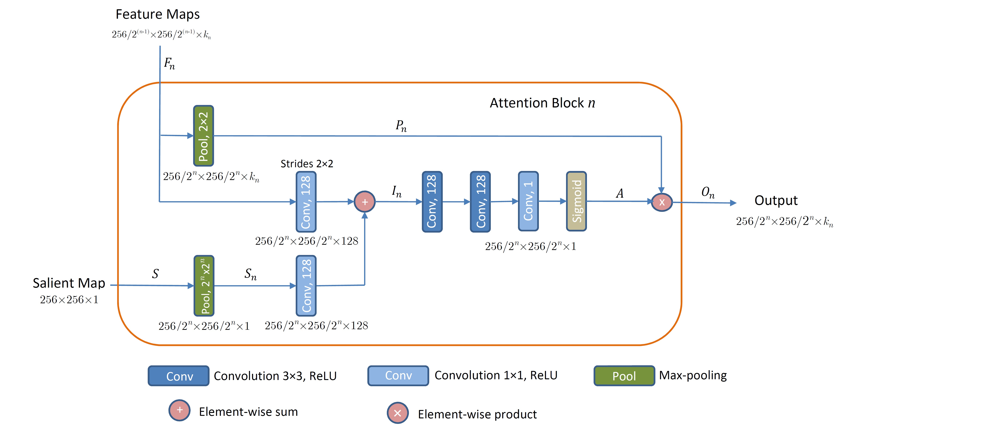

# Attention-Enriched Deep Learning Model for Breast Tumor Segmentation in Ultrasound Images

---

## Project Summary

Breast tumor segmentation in ultrasound images poses unique challenges due to high variability in tumor shape and boundaries. Unlike other organs, classical priors such as shape or boundary constraints are difficult to apply. To address this, we propose integrating **visual saliency** — which highlights regions likely to attract radiologists’ attention — into a deep learning framework.

Our approach enriches the standard U-Net architecture with **attention blocks** that prioritize salient spatial regions, improving tumor segmentation accuracy. Experimental results demonstrate significant performance gains compared to baseline models without attention.

---

## Repository Contents

- **Jupyter Notebooks implementing the models:**
  - [UNet.ipynb](Codes/UNet.ipynb) — Standard U-Net baseline for breast tumor segmentation.  
  - [UNet_SA.ipynb](Codes/UNet_SA.ipynb) — Salient Attention U-Net incorporating attention blocks with saliency maps.  
  - [UNet_SA_C.ipynb](Codes/UNet_SA_C.ipynb) — Variant applying attention on the most salient contour in saliency maps.

---

## Segmentation Results

The figure below shows comparative segmentation outputs:  
- **Column 1:** Original ultrasound image  
- **Column 2:** Ground truth segmentation mask  
- **Column 3:** Saliency map highlighting regions of interest  
- **Column 4:** Segmentation by baseline U-Net  
- **Column 5:** Segmentation by Salient Attention U-Net  

  

  

  

  
    

---

## Network Architecture

The **Salient Attention U-Net** architecture simultaneously processes ultrasound images and saliency maps to produce refined segmentation probability maps. Key layers include convolutional (Conv) and deconvolutional (Deconv) blocks, enhanced with attention modules.

---

## Salient Attention Block

Each attention block (indexed by \( n = 1, 2, 3, 4 \)) receives feature maps from layer \( n \) and a corresponding saliency map, outputting downsampled feature maps weighted by learned attention coefficients to emphasize salient regions.

---
